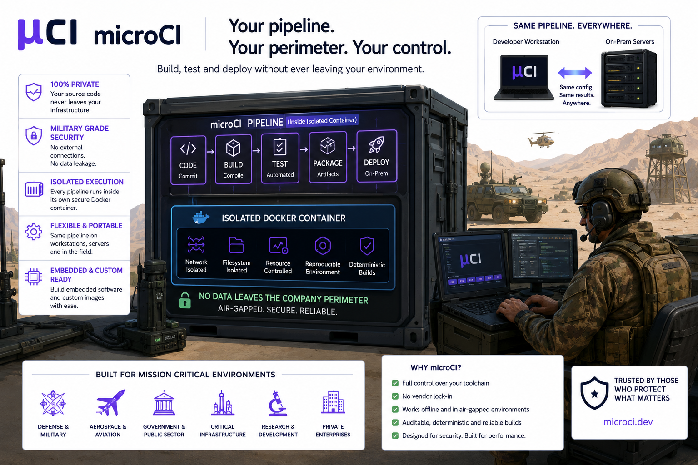

# Sovereignty

**Built for environments where trust is non-negotiable.**

Modern software delivery platforms often require organizations to place critical parts of their development process in third-party infrastructure. Source code, build artifacts, credentials, and deployment workflows frequently pass through external services, creating unnecessary exposure and reducing operational sovereignty.

**microCI takes a different approach.**

microCI was designed for organizations that require complete control over their software supply chain. Every stage of the pipeline—from source checkout and compilation to testing, packaging, and deployment—can be executed entirely within the organization's own security perimeter.

The illustration demonstrates a fully sovereign CI/CD architecture where:

* Source code never leaves company-controlled infrastructure.
* Build artifacts remain on-premises.
* No dependency exists on external CI providers.
* Sensitive intellectual property stays protected inside trusted environments.
* Development, validation, and deployment occur under a single security policy.

### Security by Isolation

At the core of microCI is a containerized execution model.

Each pipeline step executes inside a dedicated, isolated Docker container, providing:

* Reproducible build environments
* Dependency isolation
* Controlled resource access
* Reduced attack surface
* Consistent execution across all environments

Rather than depending on long-lived shared build servers, microCI creates deterministic execution environments that can be audited, versioned, and reproduced whenever required.

This approach significantly improves software supply chain integrity while simplifying compliance and accreditation activities.

### One Pipeline. Everywhere.

A common challenge in software delivery is environment drift—the gradual divergence between developer workstations, CI infrastructure, and production systems.

microCI eliminates this problem by treating the pipeline itself as a portable asset.

The exact same pipeline definition can execute:

* On a developer laptop
* On an engineering workstation
* On a build server
* In an isolated laboratory
* Inside a secure datacenter
* In classified or air-gapped environments

The result is predictable behavior, consistent outputs, and fewer deployment surprises.

### Ready for Mission-Critical Systems

The image highlights operational environments where reliability and security are essential:

* Defense and military systems
* Aerospace and aviation programs
* Tactical communication systems
* Embedded software development
* Government and public sector projects
* Critical infrastructure
* Private enterprise environments

These environments demand deterministic builds, traceability, auditability, and strict control over software assets.

microCI was built with these requirements in mind.

### Supply Chain Control Without Vendor Lock-In

microCI allows organizations to define their own toolchains, container images, security controls, and deployment targets.

Teams remain free to:

* Use standard Docker containers
* Build custom container images
* Integrate proprietary toolchains
* Operate disconnected from the internet
* Maintain full ownership of pipeline definitions

There is no requirement to adopt proprietary cloud services or surrender operational control to external platforms.

### Digital Sovereignty by Design

The illustration represents more than a CI/CD system.

It represents a software delivery model where organizations retain ownership of their code, infrastructure, processes, and security posture.

Every build stays under your control.

Every artifact remains within your perimeter.

Every deployment follows your rules.

**microCI delivers modern CI/CD automation while preserving what matters most: security, sovereignty, and trust.**

