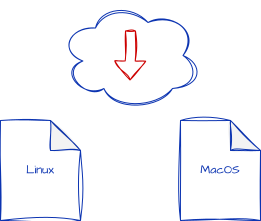

# Install microCI

microCI is designed to stay lightweight: one YAML pipeline, one generated Bash script, and a small set of runtime requirements.

## Requirements

microCI relies on a small set of standard tools:

* `bash` — runs the generated pipeline script
* `docker` — provides isolated execution environments for steps
* `jq` — handles JSON data when pipelines need to inspect or transform structured output
* `yq` — handles YAML data when pipelines need to read or update configuration files

These tools are necessary because microCI generates Bash and expects a minimal runtime layer to execute portable steps consistently across machines.

At runtime, the simplicity stays the same: `microCI | bash`.

To run only specific steps, use `-O/--only` for a single named step or `-N/--number` with one or more comma-separated step numbers, such as `microCI --number 2,3,5`.

## Install microCI

<div align="center" markdown="1">

</center>

</div>

```bash
curl -fsSL https://microci.dev/install.sh | bash
```

## Install Docker Engine

Docker is a core requirement for microCI. It provides isolated execution environments for all pipeline steps, ensuring consistency and reproducibility across different machines and operating systems.

### Quick Installation

The fastest way to install Docker Engine on most Linux distributions:

```bash
curl -fsSL https://get.docker.com | sh
```

This script automatically detects your Linux distribution and installs Docker Engine with all necessary dependencies.

### Platform-Specific Installation

For detailed installation instructions tailored to your operating system, visit the official Docker documentation:

* **Linux**: [Install Docker Engine on Linux](https://docs.docker.com/engine/install/)
* **macOS**: [Install Docker Desktop on Mac](https://docs.docker.com/desktop/setup/install/mac-install/)
* **Windows**: [Install Docker Desktop on Windows](https://docs.docker.com/desktop/setup/install/windows-install/)

### Post-Installation Configuration (Linux)

On Linux systems, Docker commands require elevated privileges by default. To use Docker as a non-root user:

```bash
sudo usermod -aG docker $USER
newgrp docker
```

After running these commands, log out and log back in for the group changes to take effect.

### Verify Installation

Confirm that Docker is properly installed and accessible:

```bash
docker --version
docker run hello-world
```

## Update

Keep the same workflow and refresh the binary:

<div align="center" markdown="1">


</div>

```bash
microCI --update | bash
```

To track development builds instead:

```bash
microCI --update-dev | bash
```

## Remove

Remove microCI from your system:

<div align="center" markdown="1">


</div>

```bash
microCI --uninstall | bash
```
