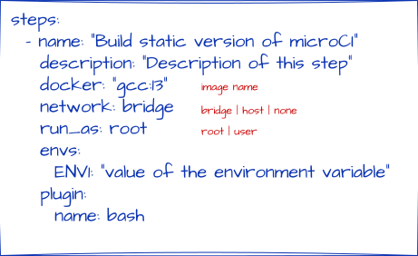

# ⚙️ Unsafe plugin

<div align="center" markdown="1">



</div>

## What it does

Run custom shell commands into host, **not inside a Docker container**.

## Why it exists

The `bash` plugin keeps pipeline logic portable.

## When to use it

Use `unsafe` when a step needs shell commands into host.

## Example

```yaml
steps:
  - name: "Run shell commands"
    plugin:
      name: unsafe
      bash: |
        echo 'hello from microCI'
```
