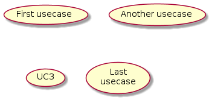
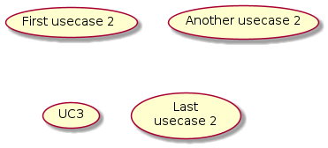
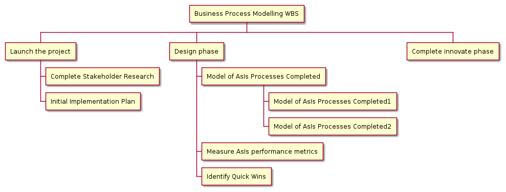

[//]: <> (Documentation generated by intmain_docmd)
Source: `dockerfiles/intmain_docmd`

# Introduction

A tool for generating documentation in Markdown format.

## Usage

```bash
intmain_docmd type source_file markdown_file
```

where `type` can be:

* `bash`
* `c++`
* `coffee`
* `conf`
* `grdb`
* `makefile`
* `nginx`
* `python`
* `ruby`
* `scss`
* `systemd`
* `vim`
* `yaml`

If no argument is provided, the program prints the help message and exits.

<details>
<summary>Details</summary>
<p>

```ruby
if ARGV.empty?
  puts """
Markdown documentation generator

intmain_docmd type source_file markdown_file

type: vim, bash, python, ruby, coffee, makefile, grdb, nginx, scss, conf, c++, systemd, yaml

To change the tool's behavior, use the following environment variables:

  INTMAIN_DOCMD_DETAILS=false     disables the details tag
  INTMAIN_DOCMD_TOC=false         disables table-of-contents generation
  INTMAIN_DOCMD_SHOW_SOURCE=false disables the source file name
  """
  exit
end
```

</p>
</details>

### Real example

This project's documentation is maintained with `intmain_docmd`:

```bash
intmain_docmd ruby     bin/intmain_docmd               doc/10_Gerador_de_documentação_intmain_docmd.md
intmain_docmd bash     bin/intmain_resize_screenshots  doc/20_Redimensionador_de_screenshots.md
intmain_docmd bash     scripts/Common/intmain.bash     doc/20_Biblioteca_de_scripts_intmain.md
intmain_docmd bash     scripts/Common/taoker.bash      doc/21_Biblioteca_de_scripts_taoker.md
intmain_docmd bash     scripts/Common/common.bash      doc/30_Biblioteca_de_funções_bash.md
intmain_docmd makefile scripts/Common/Makefile.include doc/40_Biblioteca_de_alvos_make.md
```

## Control variables

* `INTMAIN_DOCMD_DETAILS`: enables/disables code block wrapping
* `INTMAIN_DOCMD_TOC`: enables/disables table-of-contents generation
* `INTMAIN_DOCMD_SHOW_SOURCE`: shows the source file name

<details>
<summary>Details</summary>
<p>

```ruby
use_detail  = ( ENV['INTMAIN_DOCMD_DETAILS']     || 'true' ).match( /(true|t|yes|y)/i )
use_toc     = ( ENV['INTMAIN_DOCMD_TOC']         || 'true' ).match( /(true|t|yes|y)/i )
show_source = ( ENV['INTMAIN_DOCMD_SHOW_SOURCE'] || 'true' ).match( /(true|t|yes|y)/i )
```

</p>
</details>

## Callout numbers

To reference commands, use numbered items, e.g. ❶, to point to a line in the middle of the code.

<details>
<summary>Details</summary>
<p>

```ruby
def expand_shortcuts(text)
  callout_numbers = { "❶" => "❶", "❷" => "❷", "❸" => "❸",
                      "❹" => "❹", "❺" => "❺", "❻" => "❻",
                      "❼" => "❼", "❽" => "❽", "❾" => "❾",
                      "❿" => "❿", "⓫" => "⓫", "⓬" => "⓬",
                      "⓭" => "⓭", "⓮" => "⓮", "⓯" => "⓯",
                      "⓰" => "⓰", "⓱" => "⓱", "⓲" => "⓲",
                      "⓳" => "⓳", "⓴" => "⓴" }
  callout_numbers.each{ |k,v| text = text.gsub( k, v ) }
  text
end
```

</p>
</details>

## Including diagrams with PlantUML

The `plantuml` blocks below will be replaced by the diagram image.






