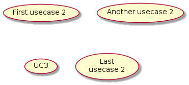

[//]: <> (Documentação gerada com intmain_docmd)
Fonte: `dockerfiles/intmain_docmd`

# Introdução

Ferramenta para geração de documentação em formato markdown.

## Uso

```bash
intmain_docmd tipo arquivo_fonte arquivo_markdown
```

onde `tipo` pode ser:

* `bash`
* `c++`
* `coffee`
* `conf`
* `grdb`
* `makefile`
* `nginx`
* `python`
* `ruby`
* `scss`
* `systemd`
* `vim`
* `yaml`

Se nenhum argumento for fornecido o programa imprime a ajuda e finaliza a execução.

<details>
<summary>Detalhes</summary>
<p>

```ruby
if ARGV.empty?
  puts """
Gerador de documentação em formato Markdown

intmain_docmd tipo arquivo_fonte arquivo_markdown

tipo: vim, bash, python, ruby, coffee, makefile, grdb, nginx, scss, conf, c++, systemd, yaml

Para alterar o comportamento da ferramenta utilize as seguintes variáveis de ambiente:

  INTMAIN_DOCMD_DETAILS=false     desabilita a tag details
  INTMAIN_DOCMD_TOC=false         desabilita a geração de sumário
  INTMAIN_DOCMD_SHOW_SOURCE=false desabilita a identificação do arquivo fonte
  """
  exit
end
```

</p>
</details>

### Exemplo real

A documentação deste projeto é mantida utilizando-se o `intmain_docmd`:

```bash
intmain_docmd ruby     bin/intmain_docmd               doc/10_Gerador_de_documentação_intmain_docmd.md
intmain_docmd bash     bin/intmain_resize_screenshots  doc/20_Redimensionador_de_screenshots.md
intmain_docmd bash     scripts/Common/intmain.bash     doc/20_Biblioteca_de_scripts_intmain.md
intmain_docmd bash     scripts/Common/taoker.bash      doc/21_Biblioteca_de_scripts_taoker.md
intmain_docmd bash     scripts/Common/common.bash      doc/30_Biblioteca_de_funções_bash.md
intmain_docmd makefile scripts/Common/Makefile.include doc/40_Biblioteca_de_alvos_make.md
```

## Variáveis de controle

* `INTMAIN_DOCMD_DETAILS`: ativa/desativa o encapsulamento dos trecho de código
* `INTMAIN_DOCMD_TOC`: ativa/desativa a geração do índice
* `INTMAIN_DOCMD_SHOW_SOURCE`: exibe o nome do arquivo de origem

<details>
<summary>Detalhes</summary>
<p>

```ruby
use_detail  = ( ENV['INTMAIN_DOCMD_DETAILS']     || 'true' ).match( /(true|t|yes|y)/i )
use_toc     = ( ENV['INTMAIN_DOCMD_TOC']         || 'true' ).match( /(true|t|yes|y)/i )
show_source = ( ENV['INTMAIN_DOCMD_SHOW_SOURCE'] || 'true' ).match( /(true|t|yes|y)/i )
```

</p>
</details>

## Callout numbers

Para referenciar comandos use itens numerados, p. e. ❶, para indicar
uma linha no meio do código.

<details>
<summary>Detalhes</summary>
<p>

```ruby
def expand_shortcuts(text)
  callout_numbers = { "❶" => "❶", "❷" => "❷", "❸" => "❸",
                      "❹" => "❹", "❺" => "❺", "❻" => "❻",
                      "❼" => "❼", "❽" => "❽", "❾" => "❾",
                      "❿" => "❿", "⓫" => "⓫", "⓬" => "⓬",
                      "⓭" => "⓭", "⓮" => "⓮", "⓯" => "⓯",
                      "⓰" => "⓰", "⓱" => "⓱", "⓲" => "⓲",
                      "⓳" => "⓳", "⓴" => "⓴" }
  callout_numbers.each{ |k,v| text = text.gsub( k, v ) }
  text
end
```

</p>
</details>

## Inclusão de diagramas com plantuml

Os trechos em `plantuml` a seguir serão substituídos pela imagem do diagrama.





