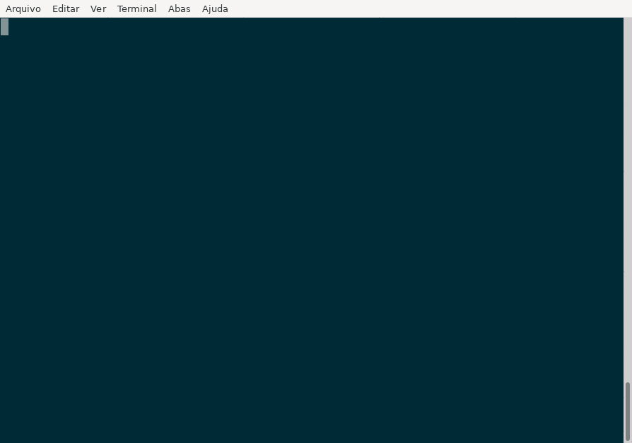
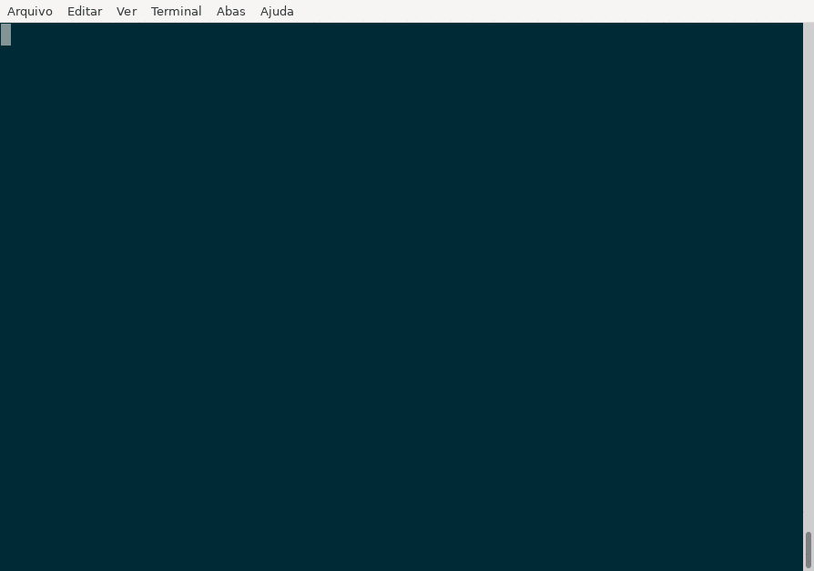
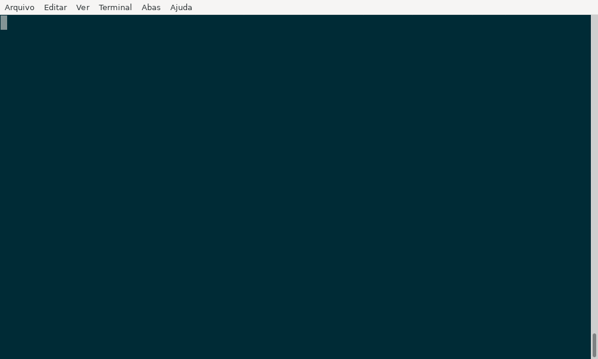
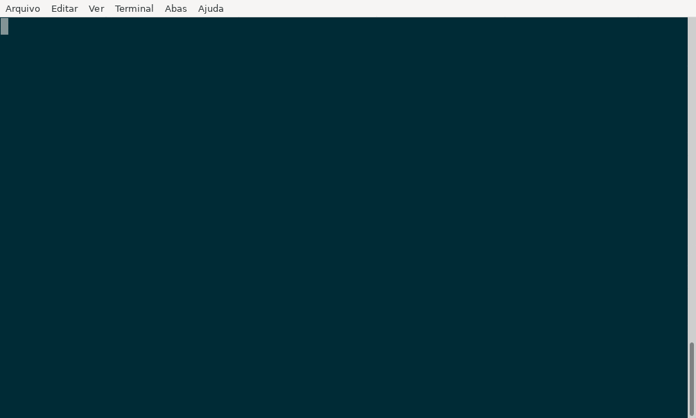

# Tutorial mkdocs

## Introdução

A ferramenta [mkdocs-material](https://squidfunk.github.io/mkdocs-material/)
oferece uma maneira prática para documentar o projeto usando arquivos no
formato markdown. Neste tutorial veremos como criar um projeto mkdocs e gerar
uma documentação usando o `microCI`.

## Configuração

O `microCI` cria um arquivo de configuração inicial para executar  o `mkdocs-material`:

```bash
microCI --new mkdocs_material
```



Um arquivo chamado `.microCI.yml` foi criado no diretório atual:

```yaml
---
steps:
  # Remova este passo após a primeira execução
  - name: "Criar arquivos iniciais do mkdocs"
    plugin:
      name: "mkdocs_material"
      action: "new ."
  - name: "Construir documentação em formato HTML"
    description: "Documentação do projeto"
    plugin:
      name: "mkdocs_material"
      action: "build"
      # Contruindo para uma pasta personalizada
      # action: "build --site-dir public
  - name: "Servidor local na porta 8000 (Ctrl+C para finalizar)"
    description: "Executa servidor local para preview da documentação"
    # passo executado localmente
    only: "local-step"
    plugin:
      name: "mkdocs_material"
      action: "serve"
      # Porta personalizada, caso já esteja utilizando a padrão 8000
      # port: 9001
```

Cada chave `name` inicia um novo passo. No arquivo criado existem 3 passos:

* `Criar arquivos iniciais do mkdocs`
* `Construir documentação em formato HTML`
* `Servidor local na porta 8000`

Passos com a chave `only` não são executados por padrão.

## Primeira execução

Edite o arquivo `.microCI.yml` para ajustar a configuração se necessário
e execute:


```bash
microCI | bash
```

Se a geração foi bem sucedida o nome dos passos seguidos de `OK` são exibidos
no terminal:


```
Criar arquivos iniciais do mkdocs...............: OK
Construir documentação em formato HTML..........: OK
```




Remova o primeiro passo (Criar arquivos iniciais do mkdocs) e execute o comando novamente:


```bash
microCI | bash
```



## Passos adicionais

A configuração contem um passo que pode ser executado sozinho para subir um
servidor para previsualizar a documentação.

```bash
microCI --only local-step | bash
```


