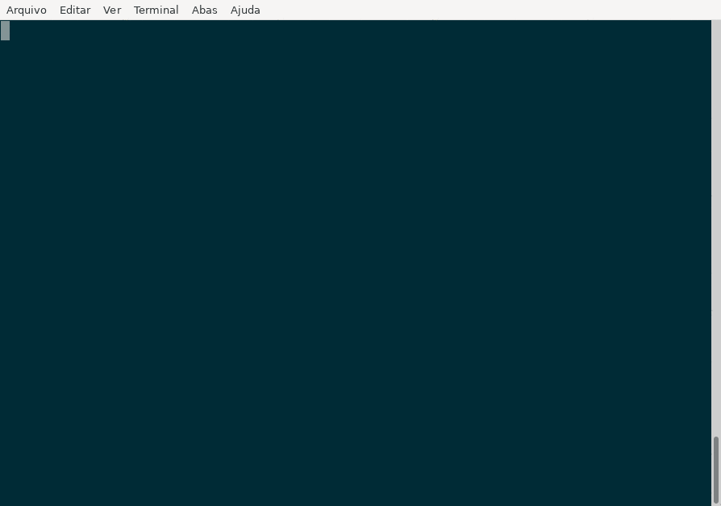
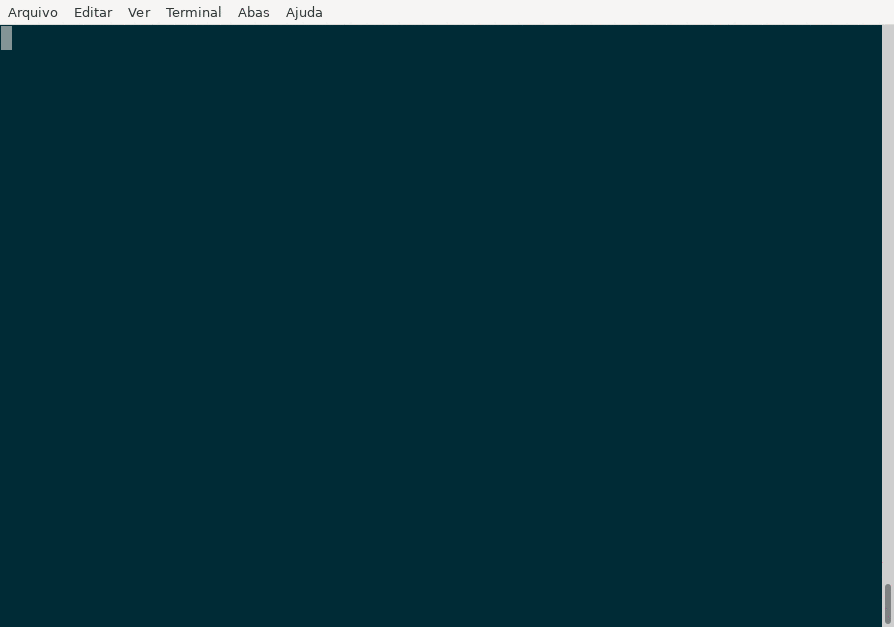
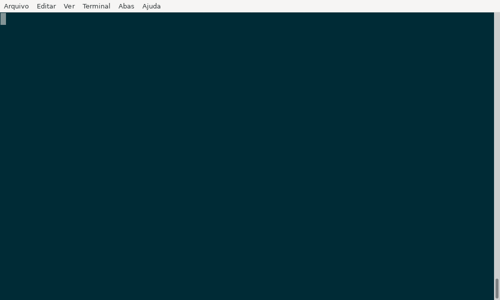
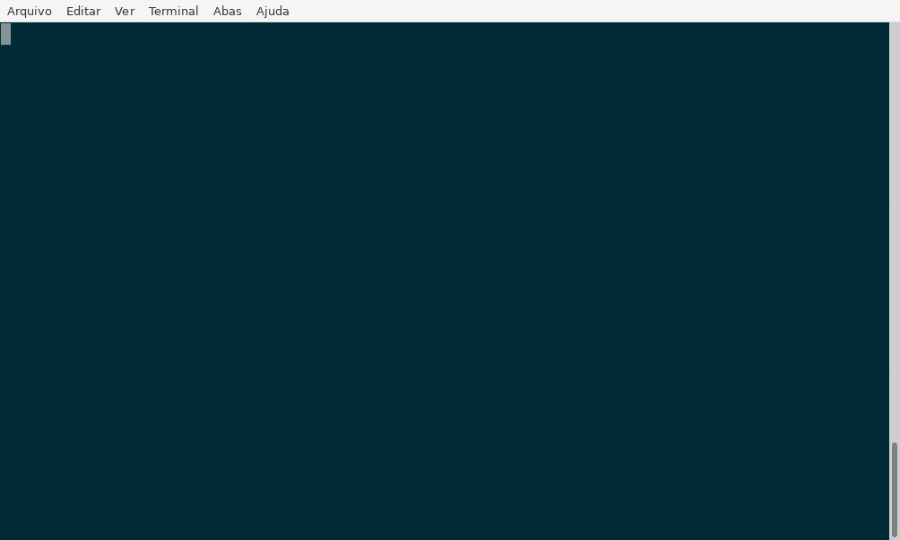

# Tutorial mkdocs local

## Introduction

The goal of this tutorial is to run `microCI` locally to create documentation.

The [mkdocs-material](https://squidfunk.github.io/mkdocs-material/) tool offers a practical way to document a project using Markdown files. In this tutorial, we'll see how to create a mkdocs project and generate documentation using `microCI`.

## microCI setup

`microCI` creates an initial configuration file to run `mkdocs-material`:

```bash
microCI --new mkdocs_material
```



A file named `.microCI.yml` was created in the current directory:

```yaml
---
steps:
  # Remove this step after the first run
  - name: "Create initial mkdocs files"
    plugin:
      name: "mkdocs_material"
      action: "new ."
  - name: "Build documentation as HTML"
    description: "Project documentation"
    plugin:
      name: "mkdocs_material"
      action: "build"
      # Build into a custom directory
      # action: "build --site-dir public
  - name: "Local server on port 8000 (Ctrl+C to stop)"
    description: "Runs a local server to preview the documentation"
    # step executed locally
    only: "local-step"
    plugin:
      name: "mkdocs_material"
      action: "serve"
      # Custom port, if you are already using the default 8000
      # port: 9001
```

Each `name` key starts a new step. The generated file contains 3 steps:

* `Create initial mkdocs files`
* `Build documentation as HTML`
* `Local server on port 8000`

Steps with the `only` key are not executed by default.

## First run

Edit `.microCI.yml` to adjust the configuration if needed, then run:

```bash
microCI | bash
```

If generation succeeds, the step names followed by `OK` are shown in the terminal:

```
Create initial mkdocs files....................: OK
Build documentation as HTML.....................: OK
```



Remove the first step (Create initial mkdocs files) and run the command again:

```bash
microCI | bash
```



## Additional steps

The configuration includes a step that can be run on its own to start a server for previewing the documentation.

```bash
microCI --only local-step | bash
```


