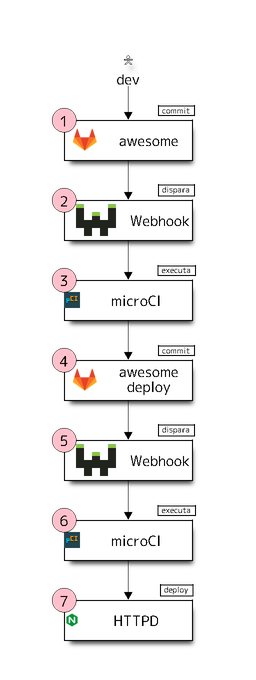

# Tutorial mkdocs servidor

## Introdução

Depois de executar o `microCI` localmente no tutorial anterrior, podemos
começar a automação da pipeline através de webhooks e execução remota.

Neste tutorial será mostrado como, a partir de um `commit` no repositório de
trabalho, é gerada a versão final e disponibilização em produção. 

A execução se dará conforme a figura abaixo:



**Evento inicial:** O desenvolvedor atualiza a documentação realiza um `commit`
e envia para o servidor git.


**Passo 1:** O servidor git recebe o evento de `push` com os `commits` do
usuário e dispara um webhook vinculado ao repositório.

> Nota: o evento de `push` ocorre uma única vez mesmo que este contenha vários
`commits`.

**Passo 2:** O servidor de webhook recebe as informações do último `commit` e
executa um script vinculado ao webhook.

> Nota: o servidor de `webhook` utilizado neste exemplo pode ser obtido
em <https://github.com/adnanh/webhook>.

Abaixo estão a declaração dois webhooks usados neste tutorial:

```yaml
# Disparado no passo 2
- id: "microCI_awesome"
  execute-command: "/usr/bin/microCI.sh"
  command-working-directory: "/opt/microCI/repos/awesome/"

# Disparado no passo 5
- id: "microCI_awesome_deploy"
  execute-command: "/usr/bin/microCI.sh"
  command-working-directory: "/opt/microCI/repos/awesome_deploy/"
```


> Nota: todos os webhooks executam o mesmo script

**Passo 3:** Uma implementação mínima do script de adaptação do webhook para o microCI 
pode ser vista a seguir:

```bash
#!/bin/bash
# Arquivo microCI.sh
# Acrescente suas personalizações aqui

if [ -d ".git" ]; then
  git pull
fi

# Este comando é executado no caminho do repositório
microCI | bash
```


> Nota: O procedimento é idêntico ao executado localmente: o `microCI` lê
a configuração do arquivo `.microCI.yml` e executa os passos descritos.

```yaml
# Arquivo .microCI.yml do repositório awesome
---
steps:
  - name: "Construir documentação em formato HTML"
    description: "Documentação do projeto"
    plugin:
      name: "mkdocs_material"
      action: "build"
  - name: "Publicar HTML para repositório git"
    ssh:
      copy_from: "${HOME}/.ssh"
      copy_to: "/root/.ssh"
    plugin:
      name: "git_publish"
      git_url: "git@nome_do_servidor.com.br:awesome_deploy.git"
      copy_to: "/deploy"
      copy_from: "site"
      clean_before: true
```

O plugin `mkdocs_material` com a ação `build` lê os arquivos markdown
e constroi a documentação em formato HTML e a salva na pasta `site` para ser
utilizada no próximo passo.

O plugin `git_publish` clona o repositório apontado por `git_url` na pasta
`/deploy`, então copia o conteúdo da pasta `site` para a pasta `/deploy`,
dentro do container, e faz o `commit` para atualizando o repostório.

**Passo 4**: O repositório `awesome_deploy` recebe o `post` lançado pelo
plugin `git_publish` no passo anterior e dispara outro webhook.

**Passo 5:** O servidor de webhook recebe as informações do último `commit` e
executa um script vinculado ao webhook.

```yaml
# Disparado no passo 5
- id: "microCI_awesome_deploy"
  execute-command: "/usr/bin/microCI.sh"
  command-working-directory: "/opt/microCI/repos/awesome_deploy/"
```

> Nota: executa o procedimento igual ao do passo 2, mas desta vez na pasta do
repositório `awesome_deploy`.

**Passo 6:** O `microCI` executa o plugin `git_deploy` que realiza o `checkout`
do repositório na pasta de implantação. Para garantir que o histórico com os
commits antigos não estarão disponíveis em produção o checkout é realizado de
forma dividida, ficando o histórico (`.git`) em uma pasta privada e somente os
arquivos do último `commit` no caminho de `deploy` especificado.

**Passo 7:** A pasta de `deploy` atualizada no passo anterior está disponível
em produção.


