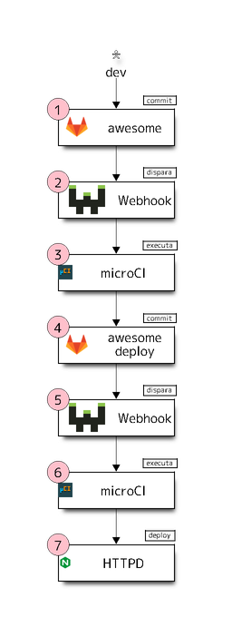

# Tutorial mkdocs server

## Introduction

After running `microCI` locally in the previous tutorial, we can start automating the pipeline through webhooks and remote execution.

This tutorial shows how a final version is generated and deployed to production from a `commit` in the working repository.

The execution will follow the figure below:



**Initial event:** The developer updates the documentation, makes a `commit`, and pushes it to the Git server.

**Step 1:** The Git server receives the `push` event with the user's `commits` and triggers a webhook linked to the repository.

> Note: the `push` event happens only once even if it contains multiple `commits`.

**Step 2:** The webhook server receives the information for the latest `commit` and runs the script linked to the webhook.

> Note: the `webhook` server used in this example can be found at <https://github.com/adnanh/webhook>.

Below is the declaration of the two webhooks used in this tutorial:

```yaml
# Triggered in step 2
- id: "microCI_awesome"
  execute-command: "/usr/bin/microCI.sh"
  command-working-directory: "/opt/microCI/repos/awesome/"

# Triggered in step 5
- id: "microCI_awesome_deploy"
  execute-command: "/usr/bin/microCI.sh"
  command-working-directory: "/opt/microCI/repos/awesome_deploy/"
```

> Note: all webhooks run the same script

**Step 3:** A minimal implementation of the webhook adapter script for microCI can be seen below:

```bash
#!/bin/bash
# microCI.sh file
# Add your customizations here

if [ -d ".git" ]; then
  git pull
fi

# This command runs in the repository directory
microCI | bash
```

> Note: The procedure is identical to the local run: `microCI` reads the configuration from `.microCI.yml` and executes the described steps.

```yaml
# .microCI.yml file for the awesome repository
---
steps:
  - name: "Build documentation as HTML"
    description: "Project documentation"
    plugin:
      name: "mkdocs_material"
      action: "build"
  - name: "Publish HTML to Git repository"
    ssh:
      copy_from: "${HOME}/.ssh"
      copy_to: "/root/.ssh"
    plugin:
      name: "git_publish"
      git_url: "git@your-server-name.com:awesome_deploy.git"
      copy_to: "/deploy"
      copy_from: "site"
      clean_before: true
```

The `mkdocs_material` plugin with the `build` action reads the Markdown files, builds the documentation as HTML, and saves it in the `site` folder for use in the next step.

The `git_publish` plugin clones the repository specified by `git_url` into `/deploy`, then copies the contents of the `site` folder into `/deploy` inside the container, and commits the update to the repository.

**Step 4**: The `awesome_deploy` repository receives the `post` sent by the `git_publish` plugin in the previous step and triggers another webhook.

**Step 5:** The webhook server receives the information for the latest `commit` and runs the script linked to the webhook.

```yaml
# Triggered in step 5
- id: "microCI_awesome_deploy"
  execute-command: "/usr/bin/microCI.sh"
  command-working-directory: "/opt/microCI/repos/awesome_deploy/"
```

> Note: it performs the same procedure as step 2, but this time in the `awesome_deploy` repository folder.

**Step 6:** `microCI` runs the `git_deploy` plugin, which checks out the repository into the deployment folder. To ensure older commits are not available in production, the checkout is split: the history (`.git`) stays in a private folder, and only the files from the latest `commit` are placed in the specified `deploy` path.

**Step 7:** The updated `deploy` folder from the previous step is now available in production.
